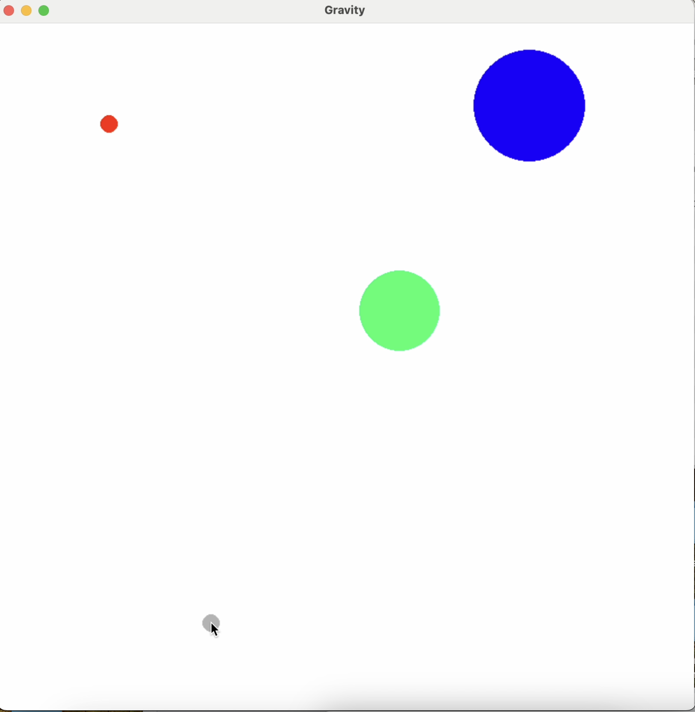

# Simple-Gravity-Simulator-Game
Simple mini-game where you can place planets and watch them interact via Newton's Universal Law of Gravitation. Note that you can add velocity to the planets when placing them by clicking and dragging (similar to angry birds). The display size is fully scaleable, and WASD can be used to move the screen. Space bar will clear the planets.

Music composed by me.
Run main.py to play the game (ensure you have pygame installed on your device, pip install pygame).

Below is a video that shows a preview of the game:

