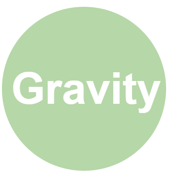
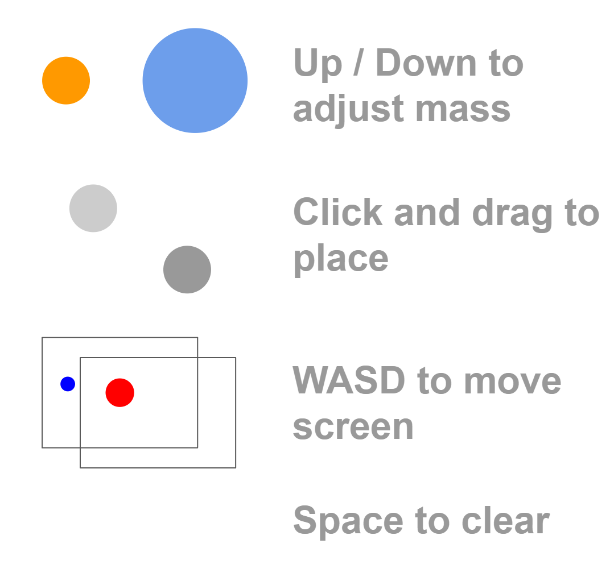

# Simple-Gravity-Simulator-Game
Simple mini-game where you can place planets and watch them interact via newtonian physics

Run main.py to play the game (ensure you have pygame installed on your device, pip install pygame).
